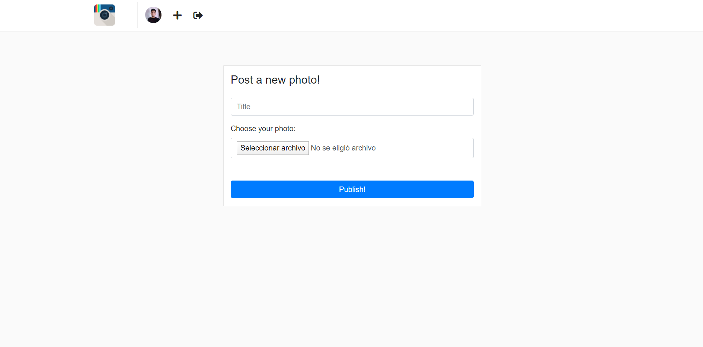

# :car: Rider app<!-- omit in toc -->

App rider with Django REST Framework

## Tabla de Contenido<!-- omit in toc -->
- [Preview](#preview)
- [How to run](#how-to-run)

See Django notes for this project  [here](/Docs/README.md)

# Preview

  
  <small>Post an image</small>

# How to run

In a Python enviroment

`python -m venv env`
`pip freeze`

Install dependences

`pip install -r requirements`

See command Django Admin

`django-admin`

Run the server app

`python manage.py runserver`
