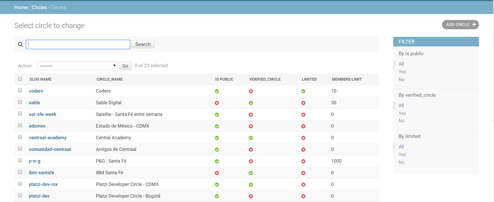

# :car: Rider app<!-- omit in toc -->

App rider with Django REST Framework

## Tabla de Contenido<!-- omit in toc -->
- [Preview](#preview)
- [Build docker image](#build-docker-image)
- [Run the stack](#run-the-stack)

<hr/>

See Django notes for this project  [here](/Docs/README.md)

# Preview

<div align="center">
  
  <small>Post an image</small>
</div>

# Build docker image
`docker-compose -f local.yml build`

Docker build the next images

* cride_local_flower 
* cride_local_celerybeat
* cride_local_celeryworker
* cride_local_django
* cride_production_postgres
* python
* postgress

# Run the stack

Run server

``docker-compose -f local.yml up``

Open the Django project
`http://localhost:8000`
`http://localhost:8000/admin/`

Validate status images
`docker-compose -f local.yml ps`

Stop services
`docker-compose -f local.yml down`

Tip
```bash
export COMPOSE_FILE=local.yml # Linux
set COMPOSE_FILE=local.yml # Windows
docker-compose build
docker-compose up
docker-compose ps
docker-compose down
```

Admin commands
``docker-compose run --rm django COMMAND``


Enable debugger
```shell
docker-compose up
docker-compose ps
docker rm -f <ID>

docker-compose run --rm --service-ports django
docker rm -f djangoavanzado_django_1
docker-compose run --rm  --service-ports django
```

Remove volume database
```bash
docker-compose ps
docker-compose down
docker volume ls
docker volume rm djangoavanzado_local_postgres_data
docker-compose up
```

Run migrations
```shell
docker-compose run --rm django python manage.py makemigrations
```

App commands

``docker-compose run --rm django python manage.py createsuperuser``
